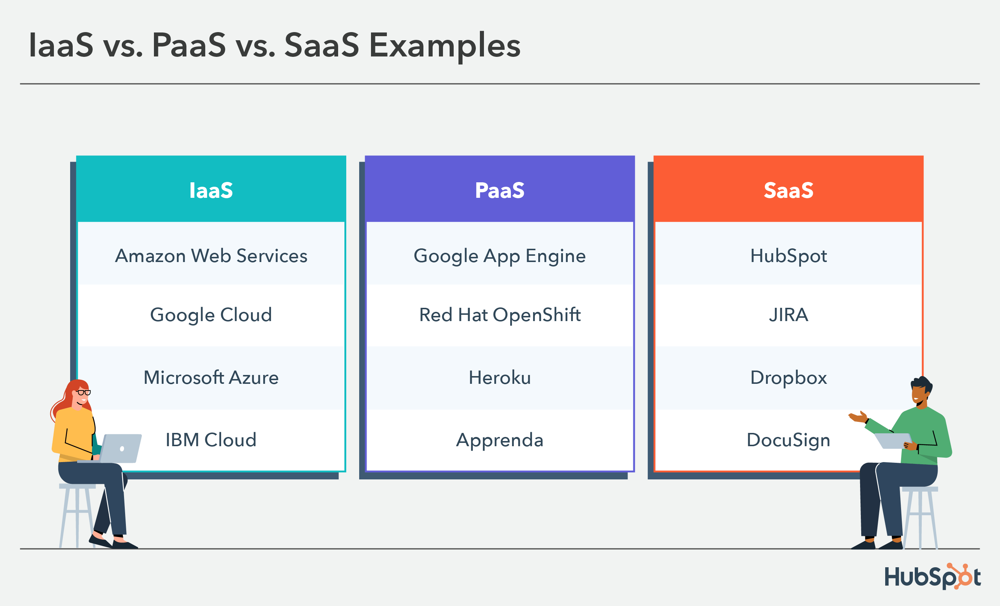

# What is cloud computing?

## Cloud Computing

Cloud computing is a technology that enables access to and delivery of computing resources, including computing power, storage, and various services, over the internet. Instead of owning and maintaining physical servers or infrastructure, users can rent or lease these resources on a pay-as-you-go basis from a cloud service provider.

Key characteristics of cloud computing include:

- **On-Demand Self-Service:** Users can provision and manage computing resources as needed without requiring human intervention from the service provider.
- **Broad Network Access:** Cloud services are accessible over the internet from various devices, such as laptops, tablets, and smartphones.
- **Resource Pooling:** Resources are pooled to serve multiple customers. Providers use multi-tenant models with different physical and virtual resources dynamically assigned and reassigned.
- **Rapid Elasticity:** Resources can be rapidly scaled up or down to accommodate changes in demand. Users only pay for the resources they consume.
-**Measured Service:** Cloud computing resources are metered, and usage can be monitored, controlled, and reported, providing transparency for both the provider and the consumer.

## Service Models

Cloud computing encompasses various service models and deployment models. Here are the primary types of cloud computing:

### Infrastructure as a Service (IaaS)
- Provides virtualized computing resources over the internet.
- Users can rent virtual machines, storage, and networking infrastructure.
- Examples: Amazon EC2, Microsoft Azure Virtual Machines.

### Platform as a Service (PaaS)
- Offers a platform allowing customers to develop, run, and manage applications without dealing with the complexities of infrastructure.
- Typically includes development frameworks, databases, and other tools.
- Examples: Heroku, Google App Engine.

### Software as a Service (SaaS):

- Delivers software applications over the internet on a subscription basis.
- Users access the software through a web browser without worrying about underlying infrastructure.
- Examples: Google Workspace, Microsoft 365, Salesforce.

## AWS Regions

### Region
A geographical area that consists of two or more Availability Zones. AWS regions are isolated from each other, and they are designed to provide low-latency and high-throughput connections between each other.

### Availability Zone (AZ):
A data center or cluster of data centers within a region. Each Availability Zone is isolated from others to protect against failures.

# IAM - Identity and Access Management

## Introduction to AWS Identity and Access Management (IAM)
AWS Identity and Access Management (IAM) is a crucial service that enables secure control over access to AWS resources. IAM allows you to manage users, groups, roles, and policies to ensure a granular and secure access control model within your AWS environment.

## IAM Components

### IAM Users
IAM users represent individuals, employees, or systems interacting with your AWS environment. Each user has a unique set of security credentials for programmatic access and a password for console access. Users can be organized into groups, and permissions can be assigned directly to users or via group membership.

### IAM Groups

Groups are a way to organize IAM users. Instead of attaching policies directly to users, you can assign policies to groups. This simplifies the process of managing permissions, especially when dealing with multiple users who require similar access levels. Users can be members of multiple groups, making it flexible to assign permissions based on roles.

### IAM Policies

IAM policies are JSON documents that define permissions. Policies specify what actions are allowed or denied on what AWS resources. Policies can be attached to IAM users, groups, or roles. They follow the principle of least privilege, ensuring that users have the minimum permissions required to perform their tasks.

### IAM Roles

IAM roles are entities with policies that define what actions users, applications, or AWS services can perform. Roles are often used to grant temporary permissions to entities outside AWS, such as applications running on EC2 instances or Lambda functions. Roles can assume other roles, allowing for delegation of permissions.

### Best Practices

1) **Principle of Least Privilege:**
    - Grant only the permissions necessary to perform a task.

2) **Regular** Monitoring:
    - Regularly review IAM configurations to ensure they align with security policies.

3) **MFA** Usage:
    Enable Multi-Factor Authentication (MFA) for an additional layer of security.

4) **Policy Conditions**:
    Use policy conditions to add an extra layer of control based on contextual criteria.

5) **Credential Rotation**:
    - Implement automatic rotation of access keys and credentials.

## MFA Multi Factor Authentiaction

Multi-Factor Authentication (MFA) is a security feature in AWS that adds an extra layer of protection to user accounts. AWS supports various MFA device options for users to enable MFA on their accounts. 

1) **Virtual MFA Devices**
   - These are software-based MFA devices that run on a smartphone or tablet.
   - Common apps include Google Authenticator and Authy.
   - Users scan a QR code to set up the virtual MFA on their device.
2) **Hardware MFA Devices:**
    - Physical hardware tokens that generate MFA codes.
    - Users receive a physical device that they can use to generate MFA codes.
    - Examples include devices from Yubico and Gemalto.

3) **SMS Text Messages:**
    - Users receive MFA codes via SMS on their registered mobile phone.
    - This option is less secure than using a dedicated MFA device.

4) **U2F Security Keys:**

    - Universal Second Factor (U2F) security keys provide hardware-based authentication.
    - Users insert the key into their computer's USB port or use a Bluetooth connection.

## AWS access ways

1) **AWS Management Console:**

    - **Web-Based Interface:** The AWS Management Console is a web-based user interface that allows users to interact with AWS services using a web browser. It provides a visual way to manage and configure AWS resources.

2) **AWS Command Line Interface (CLI):**

    - **Command-Line Access:** The AWS CLI is a command-line tool that allows users to interact with AWS services using text-based commands. It   provides a powerful and scriptable interface for managing AWS resources.

3) AWS SDKs (Software Development Kits):

    - **Programmatic Access:** AWS provides SDKs for various programming languages, including Java, Python, Ruby, and more. Developers can use these SDKs to integrate AWS services into their applications.

# EC2 - Elastic Compute Cloud

Amazon Elastic Compute Cloud (EC2) is a web service provided by Amazon Web Services (AWS) that allows users to rent virtual servers in the cloud. EC2 instances provide scalable compute capacity and are commonly used for a variety of applications, including web hosting, application development, testing, and more.

Here's a high-level summary of EC2 and the different types of EC2 instances:

## Types of EC2 Instances

Sure, here is the response in markdown format:

## EC2 Instance Types

There are many different types of Amazon Elastic Compute Cloud (EC2) instances, each with its own strengths and weaknesses. The best instance type for a particular workload will depend on the specific needs of that workload.

Here are some of the most common EC2 instance types:

**General purpose:** These instances are designed for a wide variety of workloads, including web servers, application servers, and databases. They are a good choice for workloads that do not have specific requirements for CPU, memory, or storage.

**Compute optimized:** These instances are designed for workloads that require high CPU performance. They are a good choice for workloads such as high-performance computing (HPC), scientific computing, and machine learning.

**Memory optimized:** These instances are designed for workloads that require a large amount of memory. They are a good choice for workloads such as in-memory databases, caching, and analytics.

**Storage optimized:** These instances are designed for workloads that require a large amount of storage. They are a good choice for workloads such as data warehouses, big data, and archival storage.

**Accelerated computing:** These instances are designed for workloads that require specialized hardware, such as GPUs or FPGAs. They are a good choice for workloads such as graphics rendering, video encoding, and machine learning.

When choosing an EC2 instance type, it is important to consider the following factors:

* **Workload:** What type of workload will the instance be running?
* **CPU:** How much CPU performance does the workload need?
* **Memory:** How much memory does the workload need?
* **Storage:** How much storage does the workload need?
* **Network:** How much bandwidth does the workload need?
* **Cost:** How much can you afford to spend on an instance?

Once you have considered these factors, you can use the AWS Instance Type Comparison Tool to narrow down your choices. This tool allows you to compare different instance types based on a variety of factors, such as CPU, memory, storage, network, and cost.

It is also important to note that there are several different ways to pay for EC2 instances. You can pay on-demand, which means you pay for the instance by the hour. You can also purchase reserved instances, which gives you a discount on the hourly rate in exchange for committing to a one-year or three-year term. Additionally, you can use Spot Instances, which are unused instances that Amazon sells at a significantly reduced price. However, Spot Instances can be terminated at any time by Amazon if they are needed for other purposes.

By carefully considering your workload requirements and budget, you can choose the right EC2 instance type for your needs.

# EC2 - Elastic Compute Cloud

Amazon Elastic Compute Cloud (EC2) is a web service provided by Amazon Web Services (AWS) that allows users to rent virtual servers in the cloud. EC2 instances provide scalable compute capacity and are commonly used for a variety of applications, including web hosting, application development, testing, and more.

Here's a high-level summary of EC2 and the different types of EC2 instances:

## Types of EC2 Instances

Sure, here is the response in markdown format:

## EC2 Instance Types

There are many different types of Amazon Elastic Compute Cloud (EC2) instances, each with its own strengths and weaknesses. The best instance type for a particular workload will depend on the specific needs of that workload.

Here are some of the most common EC2 instance types:

**General purpose:** These instances are designed for a wide variety of workloads, including web servers, application servers, and databases. They are a good choice for workloads that do not have specific requirements for CPU, memory, or storage.

**Compute optimized:** These instances are designed for workloads that require high CPU performance. They are a good choice for workloads such as high-performance computing (HPC), scientific computing, and machine learning.

**Memory optimized:** These instances are designed for workloads that require a large amount of memory. They are a good choice for workloads such as in-memory databases, caching, and analytics.

**Storage optimized:** These instances are designed for workloads that require a large amount of storage. They are a good choice for workloads such as data warehouses, big data, and archival storage.

**Accelerated computing:** These instances are designed for workloads that require specialized hardware, such as GPUs or FPGAs. They are a good choice for workloads such as graphics rendering, video encoding, and machine learning.

When choosing an EC2 instance type, it is important to consider the following factors:

* **Workload:** What type of workload will the instance be running?
* **CPU:** How much CPU performance does the workload need?
* **Memory:** How much memory does the workload need?
* **Storage:** How much storage does the workload need?
* **Network:** How much bandwidth does the workload need?
* **Cost:** How much can you afford to spend on an instance?

Once you have considered these factors, you can use the AWS Instance Type Comparison Tool to narrow down your choices. This tool allows you to compare different instance types based on a variety of factors, such as CPU, memory, storage, network, and cost.

It is also important to note that there are several different ways to pay for EC2 instances. You can pay on-demand, which means you pay for the instance by the hour. You can also purchase reserved instances, which gives you a discount on the hourly rate in exchange for committing to a one-year or three-year term. Additionally, you can use Spot Instances, which are unused instances that Amazon sells at a significantly reduced price. However, Spot Instances can be terminated at any time by Amazon if they are needed for other purposes.

By carefully considering your workload requirements and budget, you can choose the right EC2 instance type for your needs.

## EC2 instance Purchase Options

Amazon Elastic Compute Cloud (EC2) offers a variety of instance purchase options to suit different needs and budgets. These options include:

* **On-Demand Instances:** The most flexible option, On-Demand Instances offer pay-as-you-go pricing with no upfront commitments. You can launch and terminate instances as needed, and you will only be charged for the time your instances are running.
* **Reserved Instances (RIs):** RIs provide a significant discount on the hourly usage of On-Demand Instances in exchange for a one- or three-year commitment. RIs are a good option for workloads that have predictable usage patterns.
* **Spot Instances:** Spot Instances are up to 90% cheaper than On-Demand Instances, but they can be interrupted by AWS at any time if there is not enough capacity available. Spot Instances are a good option for workloads that can be tolerant of interruptions.
* **Dedicated Hosts:** Dedicated Hosts provide you with dedicated physical servers that are fully isolated from other AWS customers. This can be a good option for workloads that require high performance or isolation.
* **Dedicated Instances:** Dedicated Instances are similar to Dedicated Hosts, but they are a more flexible option that allows you to choose the instance type that you need. Dedicated Instances can be a good option for workloads that require high performance or isolation, but that do not need a full physical server.
* **Capacity Reservations:** Capacity Reservations provide you with the ability to reserve capacity in a specific Availability Zone for a one- or three-year term. This can help you to ensure that you have enough capacity to run your workloads, even during periods of high demand.

The best EC2 instance purchase option for you will depend on your specific needs and requirements. Consider factors such as your workload's predictability, tolerance for interruptions, performance requirements, and budget when making your decision.

Here is a table that summarizes the key differences between the different EC2 instance purchase options:

| Option | Upfront Commitment | Pricing | Interruptibility | Isolation |
|---|---|---|---|---|
| On-Demand Instances | No | Pay-as-you-go | No | No |
| Reserved Instances (RIs) | Yes (1- or 3-year) | Significant discount on On-Demand Instances | No | No |
| Spot Instances | No | Up to 90% cheaper than On-Demand Instances | Yes | No |
| Dedicated Hosts | Yes (1- or 3-year) | Pay-as-you-go for the host, plus On-Demand or RI pricing for instances | No | Yes |
| Dedicated Instances | Yes (1- or 3-year) | Pay-as-you-go for the instances | No | Yes |
| Capacity Reservations | Yes (1- or 3-year) | Pay-as-you-go for the capacity reservation, plus On-Demand or RI pricing for instances | No | No |

I hope this helps!

## In addition to the above options, you can also use the following strategies to save money on your EC2 costs:

* **Right-sizing your instances:** Make sure you are using the right instance type for your workload. You can use the AWS Auto Scaling service to automatically scale your instances up or down based on demand.
* **Using RI purchase discounts:** AWS offers a variety of discounts on RIs, such as volume discounts and discounts for committing to longer terms.
* **Using Spot Instances:** Spot Instances can be a great way to save money on workloads that can be tolerant of interruptions. However, you need to be aware of the risks involved in using Spot Instances, such as the possibility of interruptions.
* **Using Capacity Reservations:** Capacity Reservations can be a good way to save money on workloads that have predictable usage patterns and require high availability.

By using a combination of these strategies, you can significantly reduce your EC2 costs.

Certainly! Here's the information formatted in Markdown with the use of tables:

## AWS Shared Responsibility Model for EC2

### AWS's Responsibilities:

| Responsibility                 | Description                                                                                          |
| ------------------------------ | ---------------------------------------------------------------------------------------------------- |
| Physical Security              | AWS is responsible for the physical security of the data centers hosting EC2 instances.               |
| Network Infrastructure         | AWS manages the underlying network infrastructure, including hardware and software components.      |
| Hypervisor Security            | AWS is responsible for securing the hypervisor, enabling multiple EC2 instances on a single host.    |
| Foundational Services Security | AWS ensures the security of foundational services like IAM, KMS, and AWS CloudTrail.                 |

### Customer's Responsibilities:

| Responsibility                    | Description                                                                                   |
| --------------------------------- | --------------------------------------------------------------------------------------------- |
| Operating System and Applications | Customers are responsible for securing the OS and applications on their EC2 instances.        |
| Data Encryption                   | Customers are responsible for encrypting data at rest and managing encryption keys.            |
| Identity and Access Management    | Customers configure and manage IAM roles and permissions for users and applications.           |
| Firewall and Security Groups      | Customers configure security groups and network ACLs to control inbound and outbound traffic. |
| Data Backups and Recovery          | Customers implement backup strategies and mechanisms for data recovery in case of incidents.  |
| Application Security              | Security measures related to applications running on EC2 instances are the customer's duty.   |
| Instance Security                 | Customers secure EC2 instances, manage access, and implement host-based firewalls.            |

Understanding and adhering to the shared responsibility model is crucial for ensuring a secure AWS environment. It guides customers in making informed decisions about security controls, monitoring, and incident response.